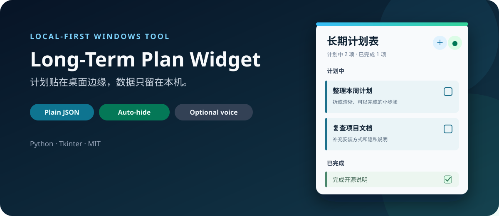

<p align="center">
  
</p>

<p align="center">
  <a href="./README.md">English</a>
  ·
  
  
</p>

# 长期计划表

一个轻量、本地优先的 Windows 桌面计划工具。它以紧凑小窗口常驻桌面，用普通 JSON 保存任务，并可选用本地 Whisper 模型把中文语音整理成计划。

## 主要能力

- 小巧置顶窗口，可调透明度
- 支持贴边、自动隐藏和细窄唤出拉手
- 新增、编辑、完成、恢复和删除计划
- 从“今天”“明天”及明确日期等中文表达中提取目标日期
- 三套视觉皮肤，其中两套带横幅素材
- 本地 JSON 存储，原子写入并自动保留上一份备份
- 可选的 `faster-whisper` 本地语音识别
- 单实例运行，重复启动会唤出已有窗口
- 无账号、无统计、无遥测，不上传计划内容

## 环境要求

- Windows 10 或 Windows 11
- Python 3.10 或更高版本（Windows 官方安装包自带 Tkinter）

核心计划功能只依赖 Python 标准库。若要启用图片皮肤和语音输入，请安装可选依赖：

```powershell
py -3 -m venv .venv
.\.venv\Scripts\Activate.ps1
python -m pip install -r requirements.txt
```

## 从源码运行

```powershell
git clone https://github.com/WinTrae/long-term-plan-widget.git
cd long-term-plan-widget
py -3 .\plan_widget.pyw
```

也可以双击 `launch_plan_widget.vbs` 静默启动。该启动器会自动查找 `pythonw.exe`，不包含任何特定电脑的用户路径。

首次启动会自动创建 `plan_data.json`。真实计划、窗口设置、日志、模型文件和构建产物都已被 `.gitignore` 排除。

## 可选语音输入

安装 `requirements.txt` 后，按住麦克风按钮说出中文计划，松开即可转写。首次使用可能会把 Whisper `small` 模型下载到 `models/`，语音转写在本机执行。

如需禁止下载、只允许读取已经缓存的模型：

```powershell
$env:PLAN_WIDGET_OFFLINE_ONLY = "1"
py -3 .\plan_widget.pyw
```

本仓库不包含语音模型。

## 数据格式

`plan_data.example.json` 提供了脱敏示例。需要示例任务时可复制为真实数据文件：

```powershell
Copy-Item .\plan_data.example.json .\plan_data.json
```

程序采用原子写入，并把上一份数据保存为 `plan_data.json.bak`。

## 测试

```powershell
$env:PYTHONDONTWRITEBYTECODE = "1"
python -B -m unittest discover -s .\tests -p "test_*.py" -v
```

## 隐私说明

公开仓库只包含通用示例数据。请勿提交 `plan_data.json`、`settings.json`、日志、真实计划截图或本地语音模型缓存。

## 开源许可

MIT

